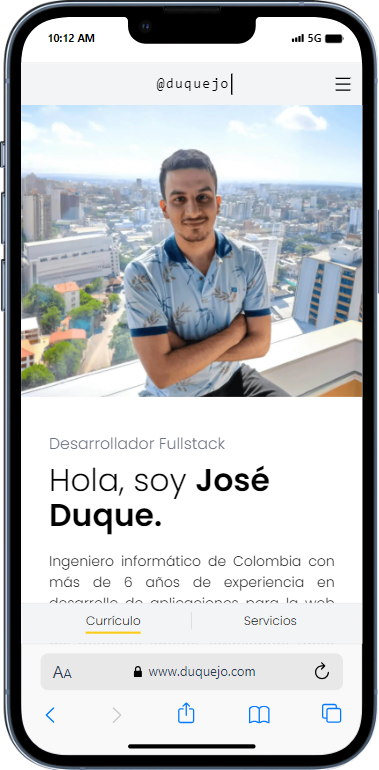

# José Duque Curriculum Vitae (old)

Hi!, Welcome to my legacy GitHub CV repository dedicated to showcasing my professional journey! This repository serves as an interactive and dynamic Curriculum Vitae, providing an in-depth look at my skills, experiences, and projects. Please visit the renewed site, that has modern features like SSR and SEO optimization given by Next JS: https://github.com/duquejo/duquejo-cv-next

Thank you for visiting, and I look forward to connecting with you!

## Table of Contents

- [Tecnologies & Tools](#tecnologies)
- [Installation](#installation)
- [Live Screenshots](#screenshots)
- [Support](#support)
- [Contributing](#contributing)

## Tecnologies

- Typescript (Strong typed JS language)
- Vue JS (Frontend framework )
- Vue Router (Routing & SPA features)
- Vite (Bundling, HMR Development, etc)
- Vitest (Vite-native testing framework)
- Tailwind (Utility-first CSS Framework)
- TanStack Vue-Query (HTTP Requests state management)
- Axios (External HTTP Requests handling)
- Vue I18N (Internationalization)
- Vercel (Deployment & Statistics)

## Installation

Download the project directory and follow the next steps:

- 1. Copy the `.env.sample` file, rename it as `.env`, and complete the local environment variables for the Github connection and the site translation features.
- 2. Install the packages using `yarn install`.
- 3. Run `yarn dev` for start the vite development environment or `yarn build` to start the production bundling package process.

## Screenshots

 
  
  

## Support

Please [open an issue](https://github.com/duquejo/vue-cv/issues/new/) for support.

## Contributing

Please contribute using [Github Flow](https://guides.github.com/introduction/flow/). Create a branch, add commits, and [open a pull request](https://github.com/duquejo/vue-cv/compare/).
